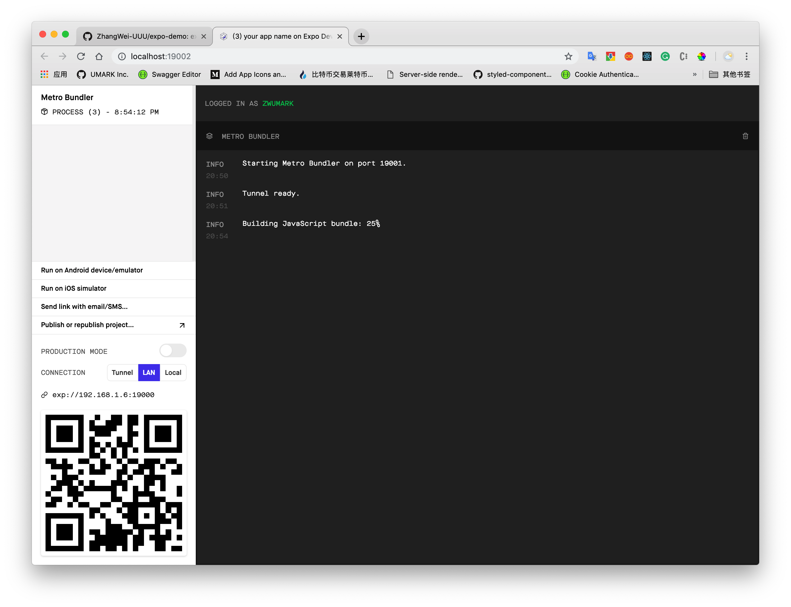

# expo-demo

为何会选择Expo？原因在于现有大多数使用js编写的所谓混合型或web型移动端应用都会面临两大问题，第一个是渲染兼容问题，第二个就是始终绕不开的原生API的调用问题。React Native作为一个多年来最为广泛使用的移动端开源项目，通过将js文件编译成原生Java,swift文件解决了第一个问题，但是在第二个问题上，依然需要开发者掌握一些基本的原生开发的基础或多或少需要写一部分原生代码，如：Java语法、权限控制、虚拟机的使用等等。而Expo在React Native基础上进行了封装，不仅提供了react-native原有的功能，而且还将原生SDK进行了封装，开发者只需通过在js文件中import某个模块就可使用移动设备的功能。而且其expo的app也提供了app 开发环境下的同步编译功能。这对于开发者而言，尤其是对于前端开发者而言无疑降低的了学习曲线。而其从开发到打包上线的一整套配套设施也为app最终上生产环境提供了强大便捷的保障。


## 编程之前该做的事

1. 初始化应用`expo init your-app-name`, 在这时会看到两个选项:`blank`和`tabs`,选择后者，在项目生产的时候会构建好基于`react-navigation`的路由页面。本Demo选择`tabs`之后根据要求填入项目名称,最后开始加载相关依赖包。

2. 添加eslint增加代码规范性`eslint --init`

3. 在Expo官网上注册好账户并下载android、ios的同名开发工具。

在开始编程之前，我们看一下整个项目是如何组成的：

app.json是整个项目的配置文件，我们先看下里面长什么样？

```json
{
  "expo": {
    "name": "your-app-name", // 应用名称
    "slug": "your-app-name",   //expo体系中下载url的后缀名
    "privacy": "public",  //项目为开源项目
    "sdkVersion": "32.0.0", // expo的SDK版本号
    "platforms": [     //移动系统所支持的两大系统
      "ios",
      "android"
    ],
    "version": "1.0.0",  //应用版本号
    "orientation": "portrait",  //显示为竖屏
    "icon": "./assets/images/icon.png", // 应用icon的图片位置
    "splash": {                         // 应用启动画面
      "image": "./assets/images/splash.png",
      "resizeMode": "contain",
      "backgroundColor": "#ffffff"
    },
    "updates": {    //更新 
      "fallbackToCacheTimeout": 0  //后台即时更新
    },
    "assetBundlePatterns": [ //静态资源绑定
      "**/*"
    ],
    "ios": {
      "supportsTablet": true //在ios中支持ipad
    }
  }
}
```

看完了配置文件，我们看下它的主文件`App.js`的内容,纵览下来几乎很前端React没有任何区别:

```js
import React from 'react';
import { Platform, StatusBar, StyleSheet, View } from 'react-native';
// expo所封装的字体、Icon等等
import { AppLoading, Asset, Font, Icon } from 'expo';
// 路由栈（后面会详细介绍）
import AppNavigator from './navigation/AppNavigator';

export default class App extends React.Component {
  state = {
    isLoadingComplete: false,
  };

  render() {
    if (!this.state.isLoadingComplete && !this.props.skipLoadingScreen) {
      //AppLoading 是Expo的自带组件，它接收的属性参数均为function,分别为需要加载的资源、报错、完成
      return (
        <AppLoading
          startAsync={this._loadResourcesAsync}
          onError={this._handleLoadingError}
          onFinish={this._handleFinishLoading}
        />
      );
    } else {
      return (
        <View style={styles.container}>
          {Platform.OS === 'ios' && <StatusBar barStyle="default" />}
          <AppNavigator />
        </View>
      );
    }
  }
  
  //异步加载资源
  _loadResourcesAsync = async () => {
    return Promise.all([
      // 首屏渲染所需要的相关图片
      Asset.loadAsync([
        require('./assets/images/robot-dev.png'),
        require('./assets/images/robot-prod.png'),
      ]),
      // 首屏渲染所需的字体库
      Font.loadAsync({...Icon.Ionicons.font,'space-mono': require('./assets/fonts/SpaceMono-Regular.ttf'),
      }),
    ]);
  };
  
  //打印错误日志
  _handleLoadingError = error => {
    console.warn(error);
  };

  _handleFinishLoading = () => {
    this.setState({ isLoadingComplete: true });
  };
}

const styles = StyleSheet.create({
  container: {
    flex: 1,
    backgroundColor: '#fff',
  },
});

```

在简单预览一下相关代码之后，我们先`yarn start`启动一下这个项目。


使用手机Expo客户端开发工具扫描二维码


