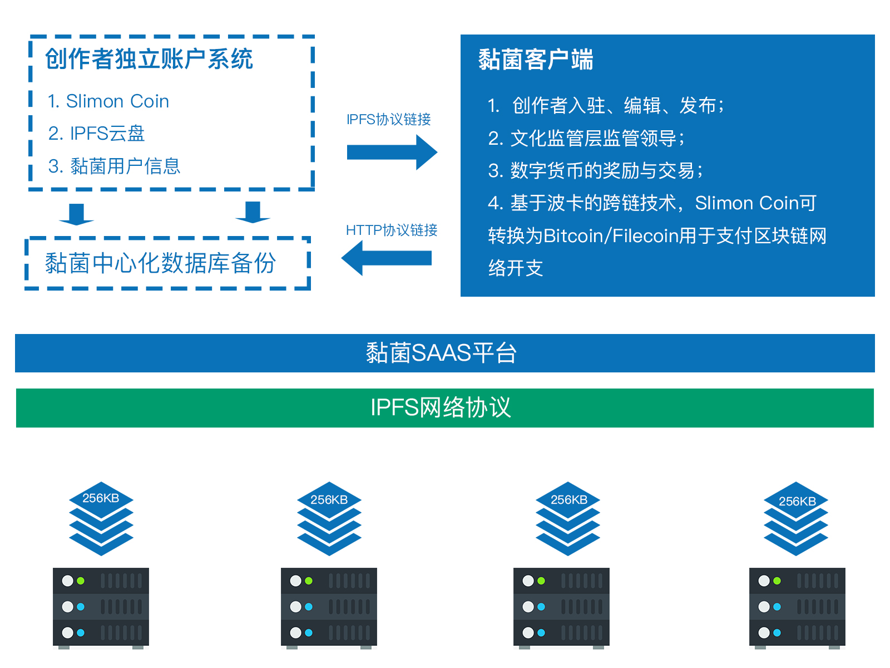

# 【黏菌】白皮书

## 简介

随着Web2.0技术和移动互联网技术的发展，以抖音、知乎、今日头条等为代表的新兴互联网媒体APP快速崛起。他们不仅加速了传统平面媒体的没落也极大了降低了传统门户新闻网站和以流量为代表的社交app的影响力。但是随着平台的逐步做大也逐渐暴露出以平台为中心的互联网媒体所带来的弊端：

1. **平台权限过高**。所谓KOL，大V不过是平台的寄生虫，平台对大V具有绝对的生杀大权。
2. **缺少平台自治权** 知识娱乐提供方缺少对自身知识产权的保护力度。
3. **没有足够的利益驱动**  平台内容提供方主要靠打赏和软文投放。微薄的收入导致社区内容贡献无法得到保障。
4. **内容低俗化** 由于资本的压力，为扩大注册用户，平台内容质量媚俗、低俗、庸俗化发展趋势几乎是所有新兴互联网媒体的必然归宿。
5. **版权内容无法保障** 由于监管层的原因，几年经营的内容可能一夜之间化为乌有。

## 商业模式

尊重市场经济的**二八定律**的同时，坚守我们的社区原则。**20%高质量用户会带来80%的互联网流量，20%的娱乐性内容带来80%的用户注册**。但是我们会坚守严肃媒体的原则底线，提供高质量的有价值的内容服务是黏菌的核心竞争力。“量社区之物力结内容创作人之欢心”。无论是我们的后续投资资金还是付费用户的充值，我们都会讲其中的大多数资金以数字货币的形式给到我们的内容提供方。在内容提供方面我们以原创作者为主线，客服人员审稿为辅助。所有主创人员的版权内容通过IPFS协议将数据存储在区块链上，对于内容创作人，他们本身具有独立的存储空间，拥有独立的版权认证机制。黏菌作为平台方通过地址寻址方式进行付费引用。如果内容创作人未来离开黏菌平台与其他平台合作，或者由于某些原因监管层要求内容下架。对于他们个人来说的创造内容、版权依然存在。不会因此被消失或者一切努力一夜之间化为乌有。

## 存储量证明（Proof-of-Saving）

众所周知，在区块链十年的发展中发展出两大挖矿机制用于驱动区块链网络的工作。一种是以比特币为代表的PoW的工作量证明机制，另一种是以波卡为代表的PoS质押量证明机制。但是在实际落地测试中，我们发现这两种机制并不适合互联网媒体行业，在黏菌区块链生态中，我们采用PoS存储量证明机制，用存储量的大小给予矿工奖励。无用的垃圾数据存储并不会给内容创作者带来任何数字货币的奖励。黏菌会基于点击率、点赞量、数据大小以及授权算法等因素作为参数进行计算，根据给予创作者货币奖励。

## 网络

## 存储

## 结论